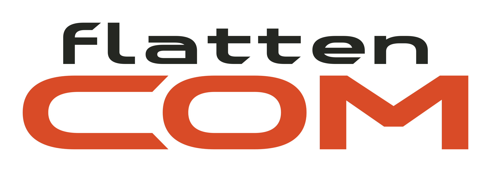

<!--
flattencom - Project Overview

Introduces components, build commands, language selection and MCP integration.

Authors:
worryzu <worryzu@gmail.com> @LinearTeam

Copyright (C) 2026 Evarentha
SPDX-License-Identifier: GPL-3.0-or-later
-->

<p align="center">
  <picture>
    <source media="(prefers-color-scheme: dark)" srcset="docs/images/logo-dark.png">
    <source media="(prefers-color-scheme: light)" srcset="docs/images/logo-light.png">
    
  </picture>
</p>

<h1 align="center">flattencom</h1>

<p align="center"><b>English</b> | <a href="README.zh-CN.md">简体中文</a></p>

<p align="center">
  Serial debugging workbench for <b>Linux and Windows</b>: a Qt desktop, CLI/TUI and MCP bridge over a shared local background service.
</p>

## Start using it

Extract the package and launch `bin/flattencom-gui` (Windows: `bin\flattencom-gui.exe`). Keep the Windows DLLs and `platforms` directory together. A Linux TGZ built without Qt deployment requires system Qt. Choose **File > Open port**, confirm the serial settings and recording directory, then connect. New GUI sessions record readable `.log` files by default.

To build on Linux, install Rust 1.98+, CMake 3.24+, Qt 6.5+ Widgets/Network/Test, Ninja, a C++20 compiler, libudev development files and pkg-config. On Debian/Ubuntu with a separately installed Qt SDK, also install `libgl1-mesa-dev` and `libxkbcommon-dev`. Project scripts require Python 3.9+. From the repository root:

```bash
cargo build --release --workspace --locked
cmake -S gui -B gui/build/release -G Ninja -DCMAKE_BUILD_TYPE=Release
cmake --build gui/build/release --parallel
./gui/build/release/flattencom-gui
```

For native Windows, use the [MSVC + Qt build instructions](docs/DEVELOPMENT.md#windows-build). Qt is needed only for the GUI; the Cargo command builds the CLI, daemon and MCP bridge. The packaging script writes local artifacts to `dist/`.

Check direct IO without hardware using a virtual echo port:

```bash
./target/release/flattencom send virtual://echo AT --expect AT
./target/release/flattencom send virtual://echo --hex "00 FF 0D 0A" --newline none
```

Echo returns bytes without executing commands. On Windows use `target\release\flattencom.exe`.

## Shared and direct access

```text
GUI / CLI attach / MCP bridge --> flattencomd --> serial device
MCP client -- stdio -----------> MCP bridge
CLI monitor / send / receive ------------------> serial device
```

- GUI and MCP can start the service as needed. Opening an active/reconnecting shared port joins the original session without changing its settings or recording.
- Closing GUI or detaching a view leaves background capture running. **Session > Close shared session** releases the port; `flattencom daemon stop` closes all service sessions.
- CLI monitor/send/receive/autobaud/replay open devices directly. Use attach/rpc when the service already owns the port:

```bash
./target/release/flattencom sessions
./target/release/flattencom attach SESSION_ID
```

Replace SESSION_ID with a listed identifier. Shared settings and writes affect all clients; local pause/display state does not. See [GUI](docs/GUI.md) and [RPC examples](docs/PROTOCOL.md#reproducible-local-example).

## Capabilities

- Send text, HEX or files; change serial settings, control lines and BREAK while connected.
- Browse continuous RX text, RX/TX chunks and separate sent history; search, highlight, mark and measure time intervals in selected output.
- Save device profiles, insert macros, repeat sends and configure board-specific reset steps.
- Record readable logs, JSONL frames or raw RX; browse saved history, export HEX/CSV/JSONL/PCAP and replay JSONL.
- Decode text, HEX, JSON lines, Modbus RTU and NMEA; add process or WASM decoders and match-triggered actions.
- Use MCP tools, resources, five prompt templates, fixed selections and cancellable jobs.

Readable capture and export default to **.log**; issue reports use **.txt**. Exports contain retained memory frames. Use saved capture files for older history and JSONL for replay. See [Recording and export](docs/RECORDING.md) for formats and retention.

## MCP and interface preferences

For clients supporting `mcpServers`, replace the executable path in this example:

```json
{"mcpServers":{"flattencom":{"command":"/absolute/path/to/flattencom-mcp","args":["--lang","en"]}}}
```

Use `.exe` on Windows. **Help > MCP setup** shows a generic local snippet. Start with list_ports/list_sessions, then open_port, send, read_frames and read_sent. A running bridge recovers its backend connection; writes with unknown outcomes are not automatically replayed. Shared selections are fixed text snapshots; enforcing one-selection access requires `flattencom-mcp --selection SELECTION_ID`. Details: [MCP](docs/MCP.md).

English is the default. **View > Language** switches in place; `--lang zh-CN` and FLATTENCOM_LANG select Chinese for supported clients. **View > Theme** offers Follow system, Light and Dark. Device bytes and protocol identifiers are not translated. Environment settings and precedence: [Internationalization](docs/I18N.md), [Troubleshooting](docs/TROUBLESHOOTING.md).

## Platforms and checks

| Platform | Support |
|---|---|
| Linux x64 | GUI, CLI/TUI, background service and MCP |
| Windows x64 | GUI, CLI/TUI, background service and MCP |
| macOS | Not supported |

Linux and Windows support None/Odd/Even/Mark/Space parity and 1/1.5/2 stop bits, subject to driver and hardware support. 1.5 stop bits require 5 data bits; 2 stop bits require 6–8. Baud/boot detection and Modbus framing have heuristic limits. See [Behavior and limits](docs/DEVELOPMENT.md#behavior-and-limits).

```bash
python3 scripts/check.py
python3 scripts/check-docs.py --smoke
```

The full checker covers formatting/lints, Rust/Qt tests and isolated GUI loopback; documentation smoke needs release binaries. See [Development](docs/DEVELOPMENT.md#package-and-install) for packaging commands.

## Components and documentation

| Component | Role |
|---|---|
| `flattencom-gui` | Qt/C++ desktop client |
| `flattencom` | CLI and TUI (direct or shared) |
| `flattencom-mcp` | Stdio MCP bridge |
| `flattencomd` | Shared sessions, recording and jobs |
| `flattencom-core` | Synchronous Rust transport/session/decoder/capture library |
| `flattencom-proto` | RPC types, message framing and Rust client library |

Qt talks local JSON-RPC over Unix sockets/Named Pipes without Rust FFI. GUI disk history reads local files. See [Architecture](docs/ARCHITECTURE.md) for data flow and source-reading order.

[GUI](docs/GUI.md) · [MCP](docs/MCP.md) · [Recording](docs/RECORDING.md) · [Protocol](docs/PROTOCOL.md) · [Workbench RPC](docs/WORKBENCH-RPC.md) · [Development](docs/DEVELOPMENT.md) · [Internationalization](docs/I18N.md) · [Wording](docs/UI-TEXT.md) · [Roadmap](docs/ROADMAP.md)

## License

GPL-3.0-or-later, Copyright (C) 2026 Evarentha. See [LICENSE](LICENSE).
